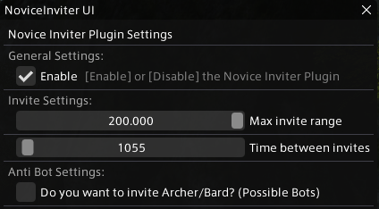

# Novice Inviter

Novice Inviter is a Dalamud plugin for Final Fantasy XIV that automates the process of inviting sprouts (new players) to the Novice Network. This helps to foster a welcoming community and provide guidance to those who are new to the game.

## Features

The Novice Inviter interface (as shown above) includes the following features:

- **Enable**: This feature allows you to enable or disable the plugin.
- **Invite Range**: This feature allows you to set a specific range around your character. Only sprouts within this range will receive an invitation.
- **Time Between Invites**: This feature sets the time interval between each invite. You can set it anywhere between 500 to 30000 milliseconds.
- **Invite Archer/Bard**: This is a toggle feature that decides whether to invite characters with the Archer/Bard class. As most bots are Archer/Bard, inviting them may lead to issues.
